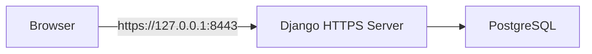

# Local Production-Like Setup

## 1. Purpose

Документ описывает локальный production-like контур после отказа от `Caddy`.

Текущая схема:

- `PostgreSQL` вместо SQLite;
- frontend и API отдаются одним Django-приложением;
- запуск через `Django` и `PostgreSQL`, без отдельного frontend build-контура и без reverse proxy;
- production-like smoke идёт по `https://127.0.0.1:8443`.

## 2. What This Contour Looks Like



## 3. Prerequisites

На машине должны быть доступны:

- Python с backend dependencies;
- PostgreSQL.

## 4. Quick Start

Из корня репозитория:

```powershell
powershell -ExecutionPolicy Bypass -File scripts/local-prodlike-setup.ps1      # первый запуск; если env уже есть — пропустить или использовать -Force
powershell -ExecutionPolicy Bypass -File scripts/local-prodlike-init.ps1       # migrate + seed для PostgreSQL-only
# или: powershell -ExecutionPolicy Bypass -File scripts/local-prodlike-postgres.ps1  # если есть backend/db.sqlite3 и нужна миграция
powershell -ExecutionPolicy Bypass -File scripts/local-prodlike-start.ps1
powershell -ExecutionPolicy Bypass -File scripts/local-prodlike-smoke.ps1
```

Остановка:

```powershell
powershell -ExecutionPolicy Bypass -File scripts/local-prodlike-stop.ps1
```

Кратко по шагам:

- `setup` — создает или пересоздает локальный prodlike env-профиль;
- `init` — готовит PostgreSQL-only контур через `migrate` и `seed_*`;
- `postgres` — помогает перейти с локального SQLite-контура на PostgreSQL;
- `start` — поднимает локальный HTTPS Django runtime;
- `smoke` — прогоняет внешний runtime smoke;
- `stop` — штатно останавливает локальный контур.

Рабочий origin:

- `https://127.0.0.1:8443`

## 5. Bootstrap

Из корня репозитория:

```powershell
powershell -ExecutionPolicy Bypass -File scripts/local-prodlike-setup.ps1 -Force
```

Команда:

- создаёт локальный env-файл `backend/.env.prodlike.local` под HTTPS-контур;
- создаёт `src/js/config/api-config.local.js` с `API_BASE_URL` и cookie refresh mode;
- генерирует безопасный `SECRET_KEY`.

## 6. Prepare PostgreSQL Runtime

### Вариант A: миграция из SQLite

```powershell
powershell -ExecutionPolicy Bypass -File scripts/local-prodlike-postgres.ps1
```

### Вариант B: PostgreSQL-only

```powershell
powershell -ExecutionPolicy Bypass -File scripts/local-prodlike-init.ps1
```

Скрипт загружает env и выполняет `migrate` и seed-команды.

## 7. Start the Contour

```powershell
powershell -ExecutionPolicy Bypass -File scripts/local-prodlike-start.ps1
```

Что делает команда:

1. грузит `backend/.env.prodlike.local`;
2. принудительно выравнивает локальный security-профиль под HTTPS;
3. применяет `migrate`;
4. поднимает Django HTTPS server на `127.0.0.1:8443`;
5. пишет логи в `logs/local-prodlike`.

Рабочий origin:

- `https://127.0.0.1:8443`

## 8. Runtime Smoke

После старта:

```powershell
powershell -ExecutionPolicy Bypass -File scripts/local-prodlike-smoke.ps1
```

Smoke script:

- проверяет `GET /api/v1/health`;
- проверяет `GET /api/v1/openapi.json`;
- проверяет `GET /api/v1/docs`;
- проходит login -> 2FA verify -> refresh -> logout в cookie-mode;
- проверяет `users/me` и `metrics`;
- проходит moderation flow: editor create proposal -> owner approve;
- подтверждает, что approved proposal создаёт технологию в PostgreSQL runtime.

## 9. Notes

- Контур intentionally same-origin: frontend отдаётся напрямую Django через templates/staticfiles.
- Контур работает по `https` через локальный self-signed сертификат, без возврата к `Caddy`.
- Для Linux production/profile c `nginx + gunicorn` нужен отдельный deployment runbook.
