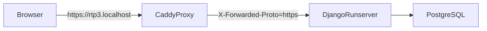

# Local Production-Like Setup

## 1. Purpose

Документ описывает локальный контур, который максимально приближен к будущему deployment profile:

- `PostgreSQL` вместо SQLite;
- `HTTPS` через локальный reverse proxy;
- `DEBUG=False` + `ENFORCE_ENV_SECURITY=True`;
- `Secure` cookies и cookie-based refresh auth;
- same-origin frontend/backend через `https://rtp3.localhost`.

## 2. What This Contour Looks Like



`rtp3.localhost` выбран как локальный hostname, потому что домен `.localhost` резолвится в loopback и не требует обязательной правки `hosts`.

## 3. Prerequisites

На машине должны быть доступны:

- Python с backend dependencies;
- Node.js / npm;
- PostgreSQL;
- Caddy в `PATH`.

## 4. Bootstrap

Из корня репозитория:

```powershell
npm run prodlike:setup
```

Команда:

- создает локальный env-файл `backend/.env.prodlike.local`;
- создает `src/js/config/api-config.local.js` с `USE_API=true` и cookie refresh mode;
- генерирует безопасный `SECRET_KEY`.

**Если env-файл уже существует:** шаг можно пропустить и перейти к п. 5–6. Либо перезаписать с `-Force`:

```powershell
npm run prodlike:setup -- -Force
```

Если нужен другой hostname или другие параметры PostgreSQL:

```powershell
powershell -ExecutionPolicy Bypass -File scripts/local-prodlike-setup.ps1 `
  -LocalHost rtp3.localhost `
  -PostgresHost localhost `
  -PostgresPort 5432 `
  -PostgresDb rtp3 `
  -PostgresUser rtp3 `
  -PostgresPassword rtp3
```

## 5. Prepare PostgreSQL Runtime

### Вариант A: Миграция из SQLite (если есть `backend/db.sqlite3`)

```powershell
npm run prodlike:postgres
```

Под капотом используется rehearsal script `postgres-dry-run.ps1` (экспорт из SQLite → загрузка в PostgreSQL).

### Вариант B: PostgreSQL-only (без SQLite)

Если SQLite нет, используйте `prodlike:init`:

```powershell
npm run prodlike:init
```

Скрипт загружает env, выполняет migrate и seed (references, technologies, users), при необходимости — smoke.

## 6. Start the Contour

```powershell
npm run prodlike:start
```

Что делает команда:

1. грузит `backend/.env.prodlike.local`;
2. собирает frontend (`npm run build`);
3. применяет `migrate`;
4. поднимает Django на `127.0.0.1:8000`;
5. рендерит `ops/local/Caddyfile.local` из шаблона;
6. запускает Caddy и открывает origin `https://rtp3.localhost`.

Если локальный CA Caddy еще не доверен, выполните:

```powershell
powershell -ExecutionPolicy Bypass -File scripts/local-prodlike-start.ps1 -TrustCaddyCA
```

## 7. Runtime Smoke

После старта:

```powershell
npm run prodlike:smoke
```

Smoke script:

- проверяет `GET /api/v1/health`;
- проверяет `GET /api/v1/openapi.json`;
- проверяет `GET /api/v1/docs`;
- проходит login -> 2FA verify -> refresh -> logout в cookie-mode;
- проверяет `Secure` cookies;
- проверяет `users/me` и `metrics`;
- проходит moderation flow: editor create proposal -> owner approve;
- подтверждает, что approved proposal создает технологию в PostgreSQL runtime.

## 8. Notes

- Локальный contour intentionally same-origin: frontend отдается Django через `SERVE_FRONTEND_FROM_DJANGO=True`, а Caddy только завершает HTTPS и пробрасывает proxy headers.
- Если вы хотите отдельный frontend origin для более строгого test AD rehearsal, базой остается `backend/.env.test.example`, но для ежедневной разработки текущая схема проще и стабильнее.
- Direct access к `http://127.0.0.1:8000` в этом режиме не является пользовательским origin; рабочий адрес только `https://rtp3.localhost`.
